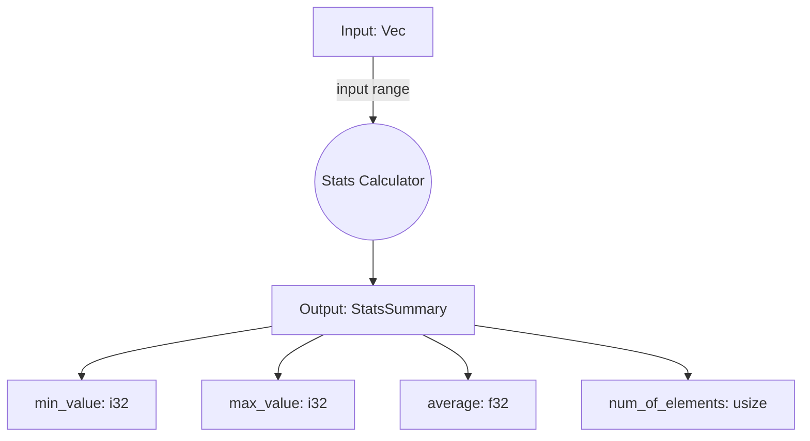
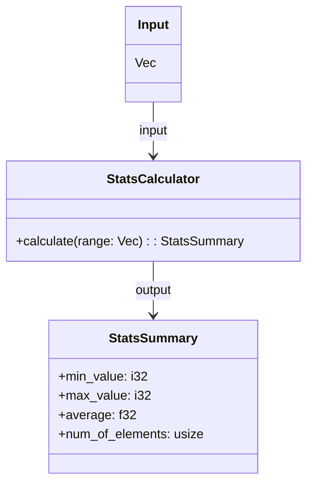
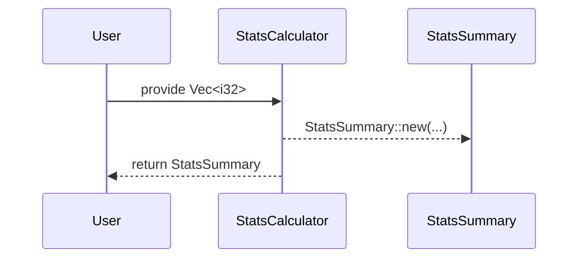

# stats-calculator.rs

## Learning Objectives

- Thinking through your solutions using FA²STR (upfront & emergent).
- Continuing to work backwards with Arrange-Act-Assert.
- Continuing to design out an API that you find easy to work with using the Program by Wishful Thinking technique.
- Clarify Before You Verify.

## FA²STR

### FIND

**Problem Description:**

> Your task is to process a sequence of integer numbers to determine some statistics (without using system Math library functions). 
>
> For example the input `[2, 4, 21, -8, 53, 40]` should output:
> 
> - minimum value = -8, 
> - maximum value = 53, 
> - number of elements in the sequence = 6, 
> - average value = 18.666666666667

#### Find the minimum value

- Input: `[1,2,3,4,5]`. Output: `1`
- Input: `[3,2,4,5]`. Output: `2`

#### Find the maximum value

- Input: `[1,2,3,4,5]`. Output: `5`
- Input: `[1,2,10,4,5]`. Output: `10`

#### Calculate the number of elements in the sequence

Input: `[1,2,3,4,5]`. Output: `5`
Input: `[1,2,3,4,5,6,7,8]`. Output: `8`

#### Calculate the average value

- Input: `[2, 4, 6, 8, 10]`. Output: `6`
- Input: `[1,2,3,7]`. Output: `3,25`

#### Returns StatsSummary

- Input: `[2, 4, 6, 8, 10]`. 
- Output:
```rust
StatsSummary {
  min_value: 2,
  max_value: 10,
  average: 6,
  num_of_elements: 5 
}
```

- Input: `[1, 2, 3, 7]`. 
- Output:

```rust
StatsSummary {
  min_value: 1,
  max_value: 7,
  average: 3.25,
  num_of_elements: 4
}
```

### ARCHITECT

_Flowchart_


_Class diagram_


_Sequence diagram_


### AUTOMATE

Use testing in watch-mode with in-file tests.

Watch mode:
```sh 
bacon test
```

Install [bacon](https://dystroy.org/bacon/):
```sh
cargo install --locked bacon
```

### SPECIFY

- it_should_be_defined
- it_should_validate_that_values_are_given
- it_should_provide_a_summary_of_the_stats

- it_should_calculate_that_the_minimum_value_in_the_range_1_2_3_4_5_is_1
- it_should_calculate_that_the_minimum_value_in_the_range_3_2_4_5_is_2

- it_should_calculate_that_the_maximum_value_in_the_range_1_2_3_4_5_is_5
- it_should_calculate_that_the_maximum_value_in_the_range_1_2_10_4_5_is_10

- it_should_calculate_that_the_amount_of_elements_in_the_range_1_2_3_4_5_is_5
- it_should_calculate_that_the_amount_of_elements_in_the_range_1_2_3_4_5_6_7_8_is_8

- it_should_calculate_that_the_average_in_the_range_2_4_6_8_10_is_6
- it_should_calculate_that_the_average_in_the_range_1_2_3_7_is_3_25

### TEST

### REFINE
